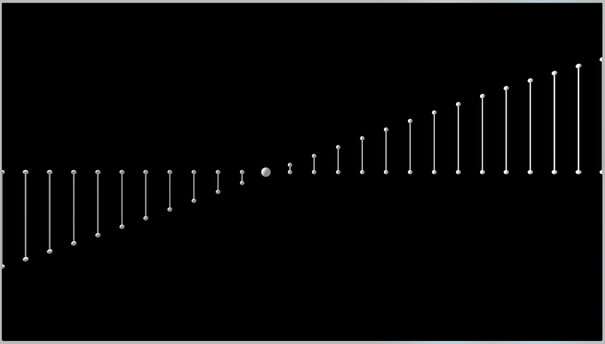

# Music in math [c++/openframeworks] 

A simple harmonic motion animation inspired in the work of [Memo Akten](http://www.memo.tv/portfolio/simple-harmonic-motion-5/)

[Facebook video](https://www.facebook.com/luiscript/videos/2098855676998598/)

