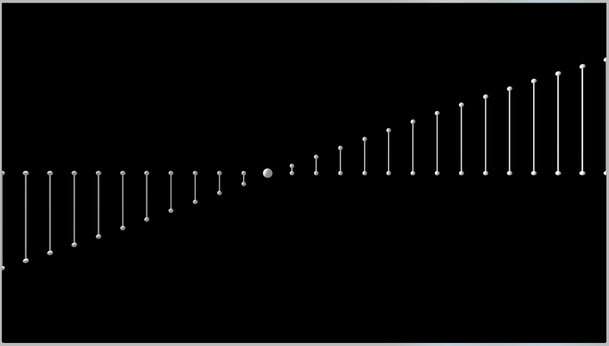

 # Social

 Creative coding projects that I post on my social channels.

[Instagram](https://www.instagram.com/luiscript/)

[Facebook](https://www.facebook.com/luiscript)

[Youtube](https://www.youtube.com/user/luiscript)

### Music in math [c++/openframeworks] 

A simple harmonic motion animation inspired in the work of [Memo Akten](http://www.memo.tv/portfolio/simple-harmonic-motion-5/)

